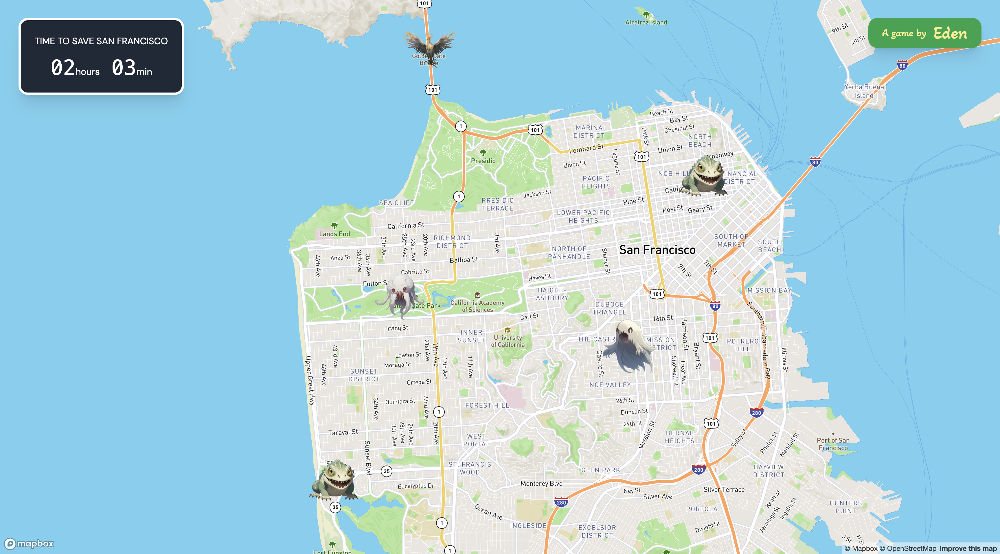

# Supabase Hackathon Project

Project built for the following supabase hackathon: https://supabase.com/blog/supabase-oss-hackathon

Monsters have envaded San Francisco and you must team up with friends to defeat them by performing mindfull exercises.

Live demo: https://supabase-hackathon-six.vercel.app/

## Tech Stack

-   Next.js
-   Tailwind
-   Supabase
-   Mapbox

## Screenshots

